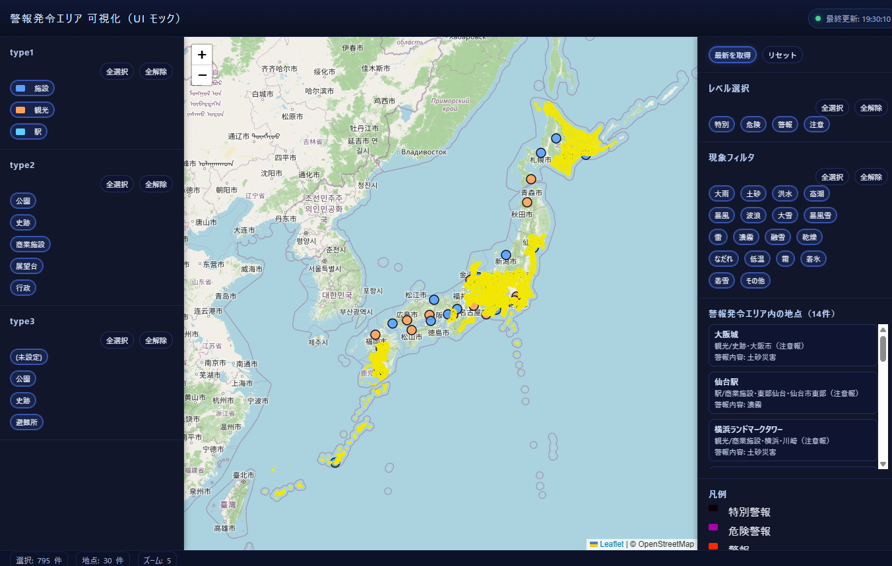

# 警報発令エリア 可視化マップ（Google Apps Script）

気象庁の特別警報・警報・注意報の発表状況と、任意の地点（POI）をひとつの地図上に重ねて表示する
Google Apps Script（GAS）製の Web アプリです。



> GASを使わず **Windows標準機能だけ** で同じ画面を動かすC#移植版を [`csharp/`](csharp/) に同梱しています
> （インストール・管理者権限・追加ランタイム不要）。→ [C#移植版](#c移植版windows標準機能のみgas不要)

## ディレクトリ構成

```
├─ gas/       Apps Script 本体（clasp の rootDir）
├─ csharp/    C#移植版（Windows標準機能のみで動く・GAS不要）
├─ data/
│   ├─ boundaries/   警報エリアの境界GeoJSON（4区分・188ファイル・約193MB）
│   ├─ points.csv    POI（任意地点）のサンプルデータ
│   └─ regioncode/   地域コード対応表（ローカル集計スクリプトの出力）
├─ tools/     境界データの変換・集計スクリプト（Python）
├─ dev/
│   ├─ node/         GAS APIのモック（Node.jsだけでロジックを検証する）
│   ├─ gas-debug/    調査用のGASスニペット（clasp の push 対象外）
│   └─ samples/      調査時に保存した警報データのスナップショット
├─ docs/      スクリーンショット等
└─ _work/     作業用。巨大な生データ・旧試作・気象庁のPDF資料など（Git管理外）
```

### Apps Script 本体（`gas/`）

| ファイル | 役割 |
|---|---|
| [gas/appsscript.json](gas/appsscript.json) | GASプロジェクトのマニフェスト |
| [gas/Code.js](gas/Code.js) | `doGet()` エントリーポイント／気象庁 `r8/map.json` フィードから現況警報を集約し、GeoJSON境界と結合して返す |
| [gas/Points.js](gas/Points.js) | Googleスプレッドシートから任意地点（POI）データを読み込み、種別ごとにグルーピングして返す |
| [gas/Message_acquisition.js](gas/Message_acquisition.js) | 警報データ取得に関する補助ロジック |
| [gas/MAP.html](gas/MAP.html) | フロントエンド（Leaflet地図・フィルタUI） |
| [gas/debug_area_json_fallback.js](gas/debug_area_json_fallback.js) | 気象庁 `area.json` 周りのデバッグ用関数 |

ブラウザからアクセスすると `MAP.html` が返され、クライアント側から
`google.script.run` 経由で `getActiveWarningFeatures()` / `getPoints()` などを呼び出します。

## データソース

### 警報データ（リアルタイム）

気象庁が公開している以下のエンドポイントをサーバー側（`Code.js`）から直接取得しています。
ローカルにダンプを保持しているわけではなく、毎回ライブで取得します。

- `https://www.jma.go.jp/bosai/warning/data/r8/map.json` — 全国の現況警報・注意報フィード
- `https://www.jma.go.jp/bosai/common/const/area.json` — 地域コードの階層情報

### 警報エリアの境界データ（ポリゴン）

地図上に警報エリアを塗るためのポリゴンは、気象庁の
[予報区等GISデータ](https://www.data.jma.go.jp/developer/gis.html)
（**シェープファイル・全国一括ZIP・世界測地系JGD2011**）を GeoJSON に変換し、都道府県別に分割したものです。
`Code.js` が Google Drive 上のこれらを `DriveApp` 経由で読み込みます。

**Python等のローカル環境が用意できなくても使えるよう、変換・分割済みのGeoJSONをリポジトリに同梱しています**
（4フォルダ・合計約193MB・単一ファイル最大約6MB）。本アプリが使う4区分と元データの対応:

| 同梱フォルダ（`data/boundaries/` 配下） | 気象庁GISの区分 | 元データ（更新時のダウンロード元ZIP） |
|---|---|---|
| `1saibun/` | 一次細分区域等 | `20190125_AreaForecastLocalM_1saibun_GIS.zip` |
| `hukenyohoukutou/` | 府県予報区等 | `20190125_AreaForecastLocalM_prefecture_GIS.zip` |
| `sikutyousonnwomatometatiikitou/` | 市町村等をまとめた地域等 | `20230517_AreaForecastLocalM_matome_GIS.zip` |
| `sityousontou/` | 市町村等（**気象警報・注意報**） | `20260226_AreaInformationCity_weather_GIS.zip` |

#### 使い方（クローン後・Python不要）

1. [data/boundaries/](data/boundaries/) の4フォルダを Google Drive の `AREA_GEO_PARENT_ID` フォルダ配下にアップロード
2. GASの `admin_buildRegionIndex` を実行して `region-index.json` を生成（[正規化パイプライン](#正規化パイプライン)参照）

#### データを更新する場合（気象庁の最新版へ差し替え・geopandasが必要）

同梱データは特定時点のスナップショットです。最新の境界に更新したいときだけ、元データから再生成します。

1. 上表のZIPを[配布ページ](https://www.data.jma.go.jp/developer/gis.html)からダウンロードし `_work/gis_src/` に置く（`.zip` のままで可）
2. シェープ → GeoJSON 変換＋都道府県分割。**Python版とC#版のどちらでも同じ成果物が作れます。**

   C#版（推奨・追加インストール不要）:
   ```
   csharp\GeoTool.exe convert --in _work\gis_src\20230517_AreaForecastLocalM_matome_GIS.zip ^
                              --out data\boundaries\sikutyousonnwomatometatiikitou
   ```
   Python版（[tools/build_geojson_folders.py](tools/build_geojson_folders.py)）:
   ```
   pip install geopandas
   python tools/build_geojson_folders.py
   ```

   > C#版を推奨するのは、DBFの文字コード判定・ZIPのエントリ名（CP932）・座標の丸めの3点で
   > Python版（GDAL）より忠実に読めることを実データで確認しているためです。詳細は
   > [csharp/README.md](csharp/README.md#geotoolexe境界データ変換ツール) を参照してください。
   → 4フォルダの `<都道府県コード>_<英名>_<種別>.geojson`（例: `10_gunma_area.geojson`）が再生成されます。

> 補足: 「市町村等」は6種（気象警報／土砂災害／河川洪水／大雨危険度／地震津波／火山）あり、本アプリは
> **気象警報・注意報（`weather`）** を使用。ZIP名先頭の日付は更新日で将来変わります。シェープの属性（DBF）は
> Shift_JIS（cp932）が多く、スクリプトは cp932 → utf-8 の順で読み込みます。座標系 JGD2011 は WGS84 互換で、
> 出力は EPSG:4326（lon/lat）です。シェープ解析や大容量GeoJSONの分割はGASの実行時間・メモリ制限に不向きなため、
> この更新処理のみローカル（geopandas）で行う構成です。

#### データの出典・ライセンス

- **境界GeoJSON（同梱）**:
  「気象庁『予報区等GISデータ』（https://www.data.jma.go.jp/developer/gis.html ）を加工して作成」
  （シェープファイルをGeoJSONへ変換し、都道府県別に分割）。
- **警報・注意報（実行時に表示）**:
  出典「気象庁ホームページ（https://www.jma.go.jp/bosai/ ）」。本アプリは**気象庁が発表した情報を表示**するもので、
  独自の予報・警報を行うものではありません。

これら気象庁由来のデータ・情報の利用は、
[気象庁ホームページの利用規約](https://www.jma.go.jp/jma/kishou/info/coment.html)（公共データ利用規約 第1.0版に準拠。
**出典の明記**および**加工した旨の明記**が必要）に従ってください。本リポジトリのコードの[MITライセンス](LICENSE)は、
これら気象庁由来のデータ・情報には適用されません。

### 正規化パイプライン

取得したGeoJSON群から「地域コード → GeoJSONファイル」の対応表（`region-index.json`）を生成します。
`Code.js` はこのファイルをDriveから読み、地域コードからGeoJSONファイルIDを引いています。

#### 推奨：GASで完結（`admin_buildRegionIndex`）

`AREA_GEO_PARENT_ID` 配下のGeoJSONをDrive上で走査して `region-index.json` を生成し、
同じフォルダへ書き戻す管理関数を [gas/Code.js](gas/Code.js) に用意しています。Apps Scriptエディタで
`admin_buildRegionIndex` を実行するだけで再生成でき、ローカル処理は不要です（実行は所有者のみ）。

```js
admin_buildRegionIndex();
// => { ok: true, files: 188, features: 2602, rawCount: 2210, norm6Count: 2123 }
```

- Driveのファイル列挙からファイルIDが自動で得られるため、ローカル処理にあった
  「パス → Drive ファイルID」の変換手順が不要です。
- 生成後はサーバーキャッシュ（`region-index.json` のキャッシュ）も自動で破棄します。
- 出力構造（`loadRegionIndex_` / `findIndexEntryForCode_` が読む形）:
  - `raw`: 原コード（7桁等）→ `{ i: ファイルID, … }`
  - `norm6`: 6桁正規化コード → `{ i: ファイルID, r: 代表コード, … }`

なお `region-index.json` は多数のDrive ファイルIDを含むため、リポジトリには含めていません
（`.gitignore` 対象）。実行時はDriveから読み込み、再生成も上記のGAS関数でDrive上に対して行います。

#### 参考：ローカル（Python）

Drive権限が無い環境向けに、ローカルのGeoJSONを集計する補助スクリプトも同梱しています
（ファイルパスベースの対応表のみを出力し、Drive ファイルIDは付与しません）。

1. [tools/build_regioncode_index.py](tools/build_regioncode_index.py)
   `data/boundaries/` 配下4フォルダの `*.geojson` を走査し、各フィーチャの
   `properties.regioncode`（または `code`）を集計して
   `data/regioncode/index_regioncode.json` / `.csv` を出力します。
2. [tools/analyze_region_index.py](tools/analyze_region_index.py)
   `_work/region-index.json` を読み、構造や地域ごとの内訳を検証・分析する補助スクリプトです。

いずれもリポジトリのどこから実行してもよく、パスはスクリプト自身の位置から解決します。

### POI（任意地点）データ

Googleスプレッドシートの1シートを `name,type1,type2,type3,address,lat,lng` 列構成で読み込みます
（[gas/Points.js](gas/Points.js) の `POINTS_CFG` / `POINTS_HEADER_ALIASES` 参照）。
`type1`〜`type3` 列のヘッダー文字列はそのままUIのフィルタ見出しとして表示されます。

## 初期設定（Script Properties）

境界GeoJSONのDriveフォルダID、POIスプレッドシートIDは利用者ごとに異なるため、
ソースコードにハードコードせず Script Properties（Apps Scriptエディタ右上の
歯車アイコン → 「スクリプト プロパティ」）に設定してください。

| キー | 用途 |
|---|---|
| `AREA_GEO_PARENT_ID` | 境界GeoJSON（`region-index.json`等）を置いたDriveフォルダのID |
| `POINTS_SPREADSHEET_ID` | POI（任意地点）データを置いたGoogleスプレッドシートのID |

Apps Scriptエディタから直接実行することでも設定できます。

```js
admin_setAreaGeoFolderId('あなたのDriveフォルダID');
admin_setPointsSpreadsheetId('あなたのスプレッドシートID');
```

未設定の状態で `getFeatureByRegionCodeFlexible` / `getPoints` 等を呼ぶと、
設定が必要であることを示すエラーになります。

## ローカル開発

GAS環境を使わずにNode.jsだけでロジックを検証できるよう、簡易モック環境を用意しています。

```
node dev/node/server.js     # ブラウザで http://localhost:8787/ を開く
node dev/node/run.js        # 画面を出さずに集計結果だけ確認する
```

[dev/node/gas-mocks.js](dev/node/gas-mocks.js) が `UrlFetchApp` / `DriveApp` / `SpreadsheetApp` /
`CacheService` / `PropertiesService` をローカルファイルで再現し、
[dev/node/server.js](dev/node/server.js) がポート8787でHTTPサーバーとして起動します。
境界GeoJSONは [data/boundaries/](data/boundaries/)、POIデータは [data/points.csv](data/points.csv) を
スプレッドシート代わりに使用します。

※ `region-index.json` はリポジトリに含まれないため、ローカルモックで使う場合は `_work/region-index.json`
として配置してください（GASの `admin_buildRegionIndex` で生成したものをDriveからダウンロードする等）。

## デプロイ

[clasp](https://github.com/google/clasp) でソースを同期します。push対象は [gas/](gas/) の中身だけなので、
`.clasp.json` に **`"rootDir": "gas"`** を指定してください（`.claspignore` は不要です）。
`.clasp.json`（紐づくApps ScriptプロジェクトのID）は利用者ごとに異なるためリポジトリには含めていません。
初回は次のいずれかで自分のプロジェクトに紐付けてください。

```
npx clasp create --type webapp --title "警報発令エリア 可視化"
# 既存のApps Scriptプロジェクトに紐付ける場合
npx clasp clone <あなたのscriptId>
```

```
npx clasp push
```

**注意**: `clasp push` はスクリプトのHEADを更新するだけで、公開中のWebアプリURLには反映されません。
Apps Scriptエディタの「デプロイを管理」から既存デプロイを編集し、「新しいバージョン」として
デプロイし直す必要があります。

## C#移植版（Windows標準機能のみ・GAS不要）

同じ画面とロジックを、Windowsに最初から入っているものだけで動くC#アプリへ移植したものを
[`csharp/`](csharp/) に置いています。GoogleアカウントもDriveもスプレッドシートも使わず、
ローカルにHTTPサーバを立てて既定ブラウザに地図を表示します。

- Visual Studio / .NET SDK / NuGet / MSBuild / Node.js は不要。Windows同梱の `csc.exe` でビルドします
- [csharp/build.bat](csharp/build.bat) をダブルクリック → `JmaMap.exe`（約43KB）が生成され、
  実行するとブラウザに地図が開き、タスクトレイに常駐します
- インストール・管理者権限・ファイアウォール許可は不要（`localhost` に固定バインド）
- 境界GeoJSONは [data/boundaries/](data/boundaries/) を直接読み、POIは [data/points.csv](data/points.csv) を読みます
- ソースはすべてプレーンテキストで、`.csproj` も `.ico` も使わない（メモ帳だけで編集・ビルドできる）構成です

| GAS版 | C#移植版 |
|---|---|
| `doGet()` / `HtmlService` | `HttpListener` が `web/map.html` を返す |
| `google.script.run` | `fetch()` |
| `DriveApp` + `region-index.json`（DriveファイルID） | ローカルフォルダの直読み（起動時に索引を構築・キャッシュ） |
| `SpreadsheetApp` | `data/points.csv` |
| `CacheService`（95KB上限） | メモリ上のキャッシュ |
| `PropertiesService` | [csharp/settings.json](csharp/settings.json) |

地域コードの6桁/7桁正規化、`class10s` の子コード展開、政令市の親コードへのフォールバック、
レベル判定といったロジックはGAS版と同じ規則を移してあります。索引の構築結果
（188ファイル・2602フィーチャ・raw 2210件・norm6 2123件）もGAS版の `admin_buildRegionIndex` と一致します。

セットアップ・設定項目・制約は [csharp/README.md](csharp/README.md) を参照してください。

## ライセンス

本リポジトリの**コード**は [MIT License](LICENSE) です。
ただし `csharp/web/leaflet.js` / `csharp/web/leaflet.css` は同梱した
[Leaflet](https://leafletjs.com/) 1.9.4（BSD-2-Clause）であり、同ライブラリのライセンスに従います。

ただし、同梱の境界GeoJSON（`data/boundaries/` 配下）および実行時に表示する警報・注意報は**気象庁由来のデータ・情報**であり、
MITは適用されません。これらの利用は[気象庁ホームページの利用規約](https://www.jma.go.jp/jma/kishou/info/coment.html)
（公共データ利用規約 第1.0版準拠）に従い、**出典の明記**と**加工した旨の明記**が必要です
（詳細は本文「データの出典・ライセンス」を参照）。
